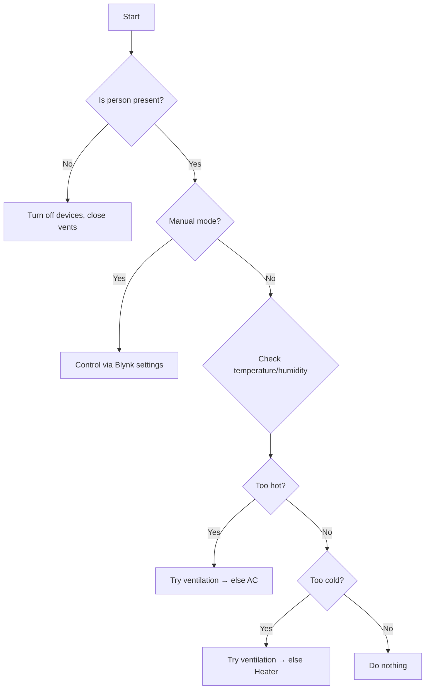

#  Smart HVAC System using ESP32 

This project is a **Smart HVAC (Heating, Ventilation, and Air Conditioning)** system built on the ESP32 platform. It automatically manages room climate based on **inside temperature/humidity**, **outside weather conditions** (via OpenWeatherMap), and **occupancy detection** (via PIR sensor). It features both **manual and automatic modes**, controlled remotely using the **Blynk IoT platform**.

---

##  Features

*  **Auto Mode**: Dynamic climate control using real-time weather and sensor data.
*  **Manual Mode**: User control over fan, AC, heater, humidifier via Blynk app.
*  **Occupancy-aware**: Auto shutdown when no one is in the room (via PIR).
*  **Weather Integration**: Uses OpenWeatherMap API to determine if it's raining or windy.
*  **EEPROM Storage**: Retains user preferences after reboot.
*  **Remote Monitoring**: Inside temperature and humidity displayed on Blynk app.
*  **Window/Vent Control**: Simulated using servo motor for ventilation logic.

---

##  Hardware Used

| Component                     | Quantity | Notes                         |
| ----------------------------- | -------- | ----------------------------- |
| ESP32 Dev Board               | 1        | Main controller               |
| DHT11 Temperature Sensor      | 1        | For indoor temp/humidity      |
| PIR Motion Sensor             | 1        | For presence detection        |
| **5V Cooling Fan**            | 1        | **Real fan, GPIO-controlled** |
| SG90 Servo Motor              | 1        | For window/vent simulation    |
| LEDs (AC, Heater, Humidifier) | 3        | For appliance simulation      |
| Resistors for LEDs            | 3        | \~220Ω                        |
| Breadboard + Jumper Wires     | -        |                               |
| Power Supply (ESP32 + Fan)    | 1        | Ensure sufficient 5V source   |

---

##  Blynk App Setup

Use the Blynk IoT app to control and monitor the system:

### Virtual Pins:

| Pin | Function                  |
| --- | ------------------------- |
| V0  | Manual Mode Toggle        |
| V1  | User Set Temp             |
| V2  | Fan Control               |
| V3  | Inside Temp (Display)     |
| V4  | Inside Humidity (Display) |
| V5  | AC Control (Manual)       |
| V6  | Heater Control            |
| V7  | Humidifier Control        |

---

##  Weather API Integration

Uses OpenWeatherMap API:

* City: Faizabad, India
* Fetches:

  * `temperature`
  * `humidity`
  * `wind speed`
  * `rain condition`

Weather logic:

* If raining or windy (>5.0 m/s), **vents/windows close automatically**.
* AC/Heater thresholds change based on outdoor temperature.

---

##  Logic Flow (Auto Mode)

---

##  EEPROM Settings Saved

* Manual mode state
* User set temperature
* Fan on/off state

---

##  Setup & Upload

### Arduino Libraries Required:

* Blynk
* ESP32Servo
* DHT sensor library
* ArduinoJson
* HTTPClient
* EEPROM

### Upload Flow:

1. Add your Wi-Fi credentials and Blynk auth token.
2. Flash to ESP32 via Arduino IDE or PlatformIO.
3. Monitor serial output @ 115200 baud.
4. Use Blynk app for control.

---

##  Future Enhancements

* Replace simulated LEDs with actual relays + AC loads.
* Add wind-direction sensor for more accurate vent logic.
* Integrate CO₂ sensor for air quality.
* Include power consumption monitoring.

---

